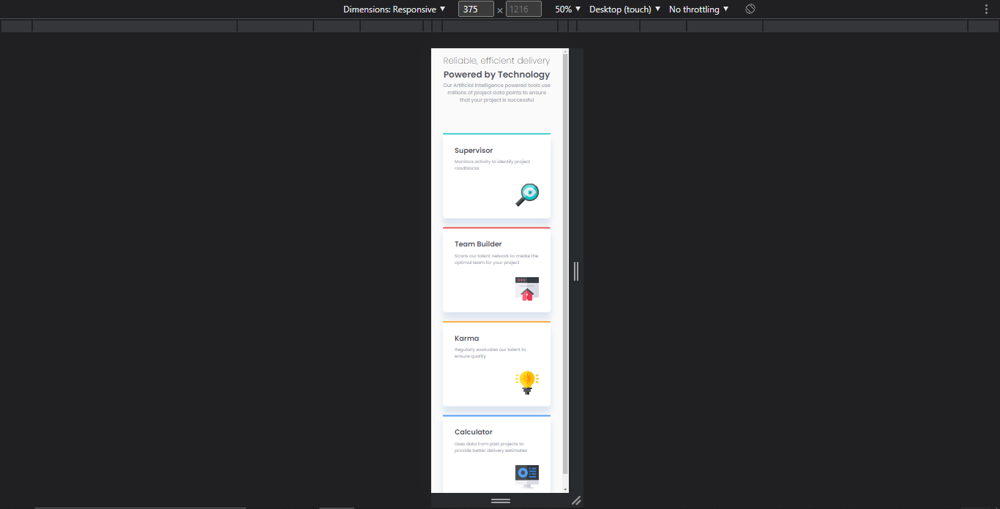

# Frontend Mentor - Four card feature section solution

This is a solution to the [Four card feature section challenge on Frontend Mentor](https://www.frontendmentor.io/challenges/four-card-feature-section-weK1eFYK). Frontend Mentor challenges help you improve your coding skills by building realistic projects. 

## Table of contents

- [Overview](#overview)
  - [The challenge](#the-challenge)
  - [Screenshot](#screenshot)
  - [Links](#links)
- [My process](#my-process)
  - [Built with](#built-with)
  - [What I learned](#what-i-learned)
  - [Continued development](#continued-development)
  - [Useful resources](#useful-resources)
- [Author](#author)

## Overview

This challange was a nice test for my flexbox skills. It wasn't hard to complete since there wasn't much content to structure in the HTML  document. Flexbox made it very easy to achieve the layout from the design. I'm happy with the way it turned out.

### The challenge

Users should be able to:

- View the optimal layout for the site depending on their device's screen size

### Screenshot

Desktop

Desktop In Dev Tools

Mobile In Dev Tools

Mobile

### Links

- Solution URL: [My Frontend Mentor Profile](https://www.frontendmentor.io/profile/dxiDavid)
- Live Site URL: [Go live](https://four-card-feature-section-challenge.pages.dev)

## My process

I started by carefully analyzing the design to determine exactly what I needed how I would I would achieve the design objective. Next I wrote the markup paying close attention to the styles I had in mind.

Once that was finished I proceed to roughly position everything (using flexbox) to what the design required then went back and changed a few things in the HTML where the elements couldn't be positioned properly. Then I set the appropriate font sizes, font colours and background colours.

I achieved the coloured line on the top part of the card using pseudo elements. However, I had initially set them to have absolute positioning but forgot to set relative positioning on the parent element. On top of that I set a fixed width which meant that on small screen sizes, it wouldn't adjust to the correct width and there was some overflow. This had me scratching my head for a solid two hours before I discovered what I had done wrong😂

### Built with

- Semantic HTML5 markup
- CSS custom properties
- Flexbox

### What I learned

I learned how to use pseudo elements, custom properties and most importantly to NEVER SET ABSOLUTE POSITIONING ON A PSEUDO ELEMENT WITHOUT RELATIVE POSITIONING ON THE PARENT ELEMENT.

### Useful resources

- [Youtube](https://www.youtube.com/@KevinPowell) - This is where I found the best tutorials and explanations (For me) on CSS concepts and      writing functional CSS. Kevin Powel really knows his stuff and gives concise explanations.
- [w3schools](https://w3schools.com) - This website has an entire course on CSS with simple examples for both basic and advanced concepts.
- [CSS Tricks](https://css-tricks.com/) - This website provides very well written explanations to CSS concepts as well as examples for when you need to revisit a concept.
- [mdn](https://developer.mozilla.org/en-US/) - Always helpful to read the documentation of any language.

## Author

- Frontend Mentor - [@dxiDavid](https://www.frontendmentor.io/profile/dxiDavid)
- Twitter - [@dxidavid254](https://www.twitter.com/dxidavid254)

